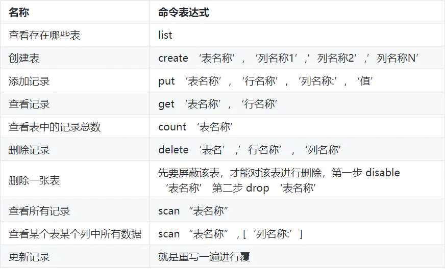

# 一、Hbase简介
1、Row Key
与nosql数据库们一样,row key是用来检索记录的主键。访问hbase table中的行，只有三种方式：

通过单个row key访问
通过row key的range
全表扫描
Row key行键 (Row key)可以是任意字符串(最大长度是 64KB，实际应用中长度一般为 10-100bytes)，在hbase内部，row key保存为字节数组。
存储时，数据按照Row key的字典序(byte order)排序存储。设计key时，要充分排序存储这个特性，将经常一起读取的行存储放到一起。(位置相关性)

字典序对int排序的结果是1,10,100,11,12,13,14,15,16,17,18,19,2,20,21,…,9,91,92,93,94,95,96,97,98,99。要保持整形的自然序，行键必须用0作左填充。
行的一次读写是原子操作 (不论一次读写多少列)。这个设计决策能够使用户很容易的理解程序在对同一个行进行并发更新操作时的行为。

2、列族 column family
hbase表中的每个列，都归属与某个列族。列族是表的chema的一部分(而列不是)，必须在使用表之前定义。列名都以列族作为前缀。例如courses:history，courses:math都属于courses这个列族。
访问控制、磁盘和内存的使用统计都是在列族层面进行的。实际应用中，列族上的控制权限能帮助我们管理不同类型的应用：我们允许一些应用可以添加新的基本数据、一些应用可以读取基本数据并创建继承的列族、一些应用则只允许浏览数据（甚至可能因为隐私的原因不能浏览所有数据）。

3、单元 Cell
HBase中通过row和columns确定的为一个存贮单元称为cell。由{row key, column( =<family> + <label>), version} 唯一确定的单元。cell中的数据是没有类型的，全部是字节码形式存贮。

4、时间戳 timestamp
每个cell都保存着同一份数据的多个版本。版本通过时间戳来索引。时间戳的类型是 64位整型。时间戳可以由hbase(在数据写入时自动 )赋值，此时时间戳是精确到毫秒的当前系统时间。时间戳也可以由客户显式赋值。如果应用程序要避免数据版本冲突，就必须自己生成具有唯一性的时间戳。每个cell中，不同版本的数据按照时间倒序排序，即最新的数据排在最前面。

为了避免数据存在过多版本造成的的管理 (包括存贮和索引)负担，hbase提供了两种数据版本回收方式。一是保存数据的最后n个版本，二是保存最近一段时间内的版本（比如最近七天）。用户可以针对每个列族进行设置。

# 二、hbase常用命令

HBase shell是HBase的一套命令行工具，类似传统数据中的sql概念，可以使用shell命令来查询HBase中数据的详细情况。安装完HBase之后，如果配置了HBase的环境变量，只要在shell中执行`hbase shell`就可以进入命令行界面。需要注意的是HBase的交互界面删除键改为了Ctrl + Backspace组合

* 查询单行： `get 'tablename','rowkey'`

* 模糊查询： `scan 'tablename',{STARTROW=>'u1_td2',STOPROW=>'u2_td5'}`
由于Hbase会将元素按照rowKey的ASCII码值排序 【# < 0-9 < :】，也可以使用 
`scan '表名',{STARTROW=>'u1_#',STOPROW=>'u2_:'}`

* 限制查询条数：`scan 'tablename',{LIMIT=>10}`

* 删除单条: `delete 'tablename','rowkey','column'`
				`deleteall 'tablename','rowkey'`
				
* 安装后第一次使用：	`source /opt/hadoopclient/bigdata_env`（/opt/hadoopclient为客户端安装目录)
* 手动认证： `kinit 用户名`