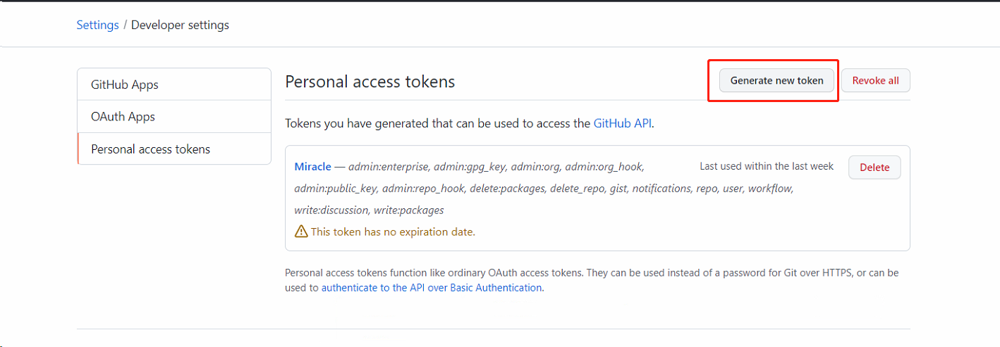

# 一、GITHUB提交代码报错
1、Support for password authentication was removed on August 13, 2021. Please use a personal access token

在登陆两个月前下载的github客户端并想上传一段一年多没更新过的博客和一个前端小项目代码时账户密码输入都是正确的却登录不上，换IDEA PUSH的时候突然爆了这个错，结合许多博客的问题都不对，最后看见了GITHUB官方公布过2021.8.13号以后只能用token登陆github而不能用账户密码登录了

# 二、解决办法：

1. 生成自己的token

   1）网页登陆github，点击头像后选择Settings

2）选择左侧developer settings

3）选择左侧Personal access tokens

4）选择Generate new token

4）note 随便起一个名字 ，expiration选择有效期（想省事并且只有自己提交代码直接选最后一个no expiration 无期限）权限只用commit pull push 这些操作 只勾上repo就可以。  自己用可以都勾上。最后点击绿色按钮Generate token  完成

